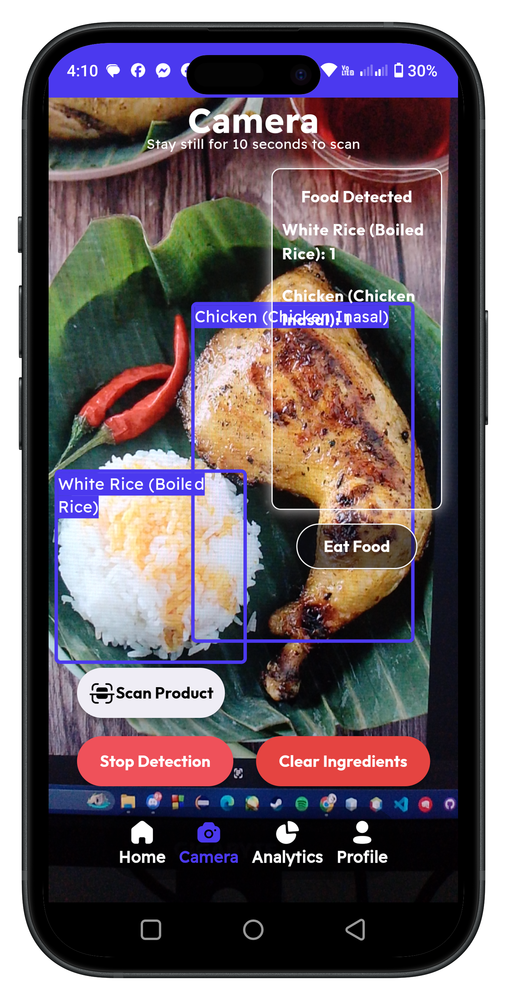
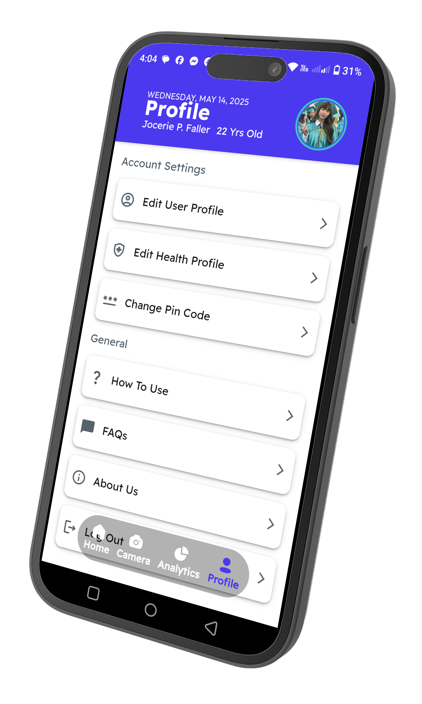

use 3.19.5
path to allen/desktop
Flutter 3.19.5 • channel stable • https://github.com/flutter/flutter.git
Framework • revision 300451adae (10 months ago) • 2024-03-27 21:54:07 -0500
Engine • revision e76c956498
Tools • Dart 3.3.3 • DevTools 2.31.1

# HealthLens Pro

## Project Overview

HealthLens Pro is a mobile application developed for my thesis titled "HEALTHLENS PRO: A MOBILE APPLICATION FOR COMMON CHRONIC DISEASES OF INDIVIDUALS WITH HEALTH-RISK USING YOLOv8 ALGORITHM" for BS Computer Science. This comprehensive health application is designed for users with common chronic diseases to monitor and track their food consumption and macronutrient intake.

## Key Features

- **Smart Food Tracking**: Comprehensive monitoring of food consumption and detailed macronutrient analysis
- **AI-Powered Food Scanner**: Utilizes YOLOv8 algorithm to instantly identify foods and calculate their nutritional content
- **Nutritional Facts Scanner**: Reads and analyzes nutrition labels from processed, packaged, and canned foods
- **Personalized Recommendations**: Calculates optimal daily macronutrient intake based on individual health profiles
- **Predictive Analytics**: Projects weight changes based on consumption patterns and metabolic factors
- **Custom Meal Planning**: Generates tailored meal suggestions that align with health requirements
- **Health Risk Alerts**: Provides warnings about potential food risks based on user's specific chronic disease
- **Data Visualization**: Presents comprehensive statistical data and historical food consumption patterns
- **Specialized Exercise Guide**: Offers exercise recommendations specifically designed for individuals with chronic conditions

## Technologies Used

- Dart
- Flutter
- TensorFlow Lite
- YOLOv8
- Roboflow
- Firebase NoSQL

## Project Timeline

Developed from May 2024 to October 2024

## Platform

Mobile Application

## License
This project is proprietary and closed-source.  
No part of this codebase may be copied, modified, or distributed without permission.

## Screenshots

### Authentication

    
    

### Main Features

    
    
    

### Health Management

    
    
    

### User Profile

    
    

